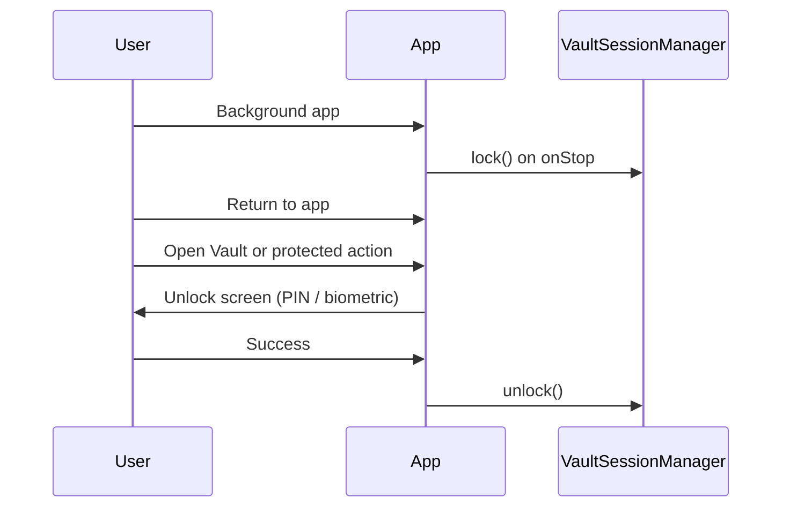

# DocuFind — App Lock

How the vault session is locked and unlocked at runtime.

## Session model

| Component | Role |
|-----------|------|
| `VaultSessionManager` | In-memory `isUnlocked` flag; cleared on lock |
| `AuthGate` | Verifies PIN (PBKDF2) or biometric, then calls `unlock()` |
| `AppLifecycleObserver` | Locks vault on `onStop` (app backgrounded) |
| `ScreenTimeoutManager` | Locks after configurable idle time while foregrounded |

Decrypted preview cache is wiped whenever `isUnlocked` becomes false (`DocuFindApplication`).

## When PIN is created

PIN setup is **deferred** — not forced on first launch.

| Trigger | Flow |
|---------|------|
| User opens **Vault** tab (no PIN yet) | `SecuritySetupFlow`: Create PIN → optional biometric → vault unlocked |
| User saves first **secure document** (no PIN yet) | Same setup overlay on Add screen, then save continues |

After setup, biometric is optional and skippable. PIN always remains the fallback.

## Unlock surfaces

| Surface | UI |
|---------|-----|
| Vault tab (locked) | Full-screen navy gradient via shared `VaultUnlockFlow`: shield + lock, **Unlock** → PIN keypad, **Use Fingerprint** |
| Home / search / recent / reminders (vault locked) | `UnlockOverlay` full-screen dialog — same `VaultUnlockFlow` |
| Settings → Security | Biometric toggle with enrollment prompt |

Title everywhere: **Unlock** (not “Unlock required”).

Main copy: **Your Vault is Locked** — *Enter PIN or use biometric to access your documents.*

## Biometric rules

- Uses AndroidX `BiometricPrompt` with `BIOMETRIC_STRONG`.
- Requires `FragmentActivity` — `MainActivity` extends `AppCompatActivity`.
- Enable button hidden when biometrics unavailable; user continues with PIN only.
- Cancel / failure → no crash; user can enter PIN.
- Auto-prompt biometric once on `UnlockOverlay` when enabled; `biometricPrompted` flag prevents recomposition loops.
- Vault tab: biometric only when user taps **Use Fingerprint** (no auto-prompt).
- Biometric success unlocks session only; PIN hash is never stored in Keystore for biometric.

## PIN rules

- 6 digits, two-step confirm on create.
- Stored as PBKDF2-HmacSHA256 hash + salt in EncryptedSharedPreferences.
- Plaintext PIN never logged (`SecureLogger` redaction).
- Haptic feedback on keypad press; shake animation on wrong PIN.
- Friendly errors via `FriendlyAuthMessages` — no raw technical text.
- Lockout after repeated failures (`LockoutManager`).

## Forgot PIN

| Condition | Behavior |
|-----------|----------|
| Biometric enabled | **Verify with biometric** → clear PIN verifier → Vault tab shows `SecuritySetupFlow` |
| Biometric not enabled | Warning: *For your security, DocuFind cannot recover your PIN…* → explicit **I understand, reset PIN** → new PIN setup |

Protected document data is not silently deleted. User must confirm before PIN reset without biometric.

## Protected navigation gates

| Entry point | Gate |
|-------------|------|
| Recent Items | `openRecord()` |
| Vault browse → record | `openRecord()` |
| Module list → record | `openRecord()` |
| Reminders → linked record/pet | `openRecord()` / `openPet()` |
| Home search | `openSearch()` |
| Direct deep link to detail (defense in depth) | `ModuleDetailViewModel` redirects to unlock |

See [DOCUFIND_PROTECTED_ACCESS_RULES.md](./DOCUFIND_PROTECTED_ACCESS_RULES.md).

## Background / foreground

Idle timeout: `MainActivity.onUserInteraction()` → `ScreenTimeoutManager.checkTimeoutAndLock()`.

## Files

- `security/session/VaultSessionManager.kt`
- `security/session/AppLifecycleObserver.kt`
- `security/session/ScreenTimeoutManager.kt`
- `security/auth/AuthGate.kt`
- `security/auth/BiometricAuthManager.kt`
- `ui/components/VaultUnlockFlow.kt`
- `ui/components/UnlockOverlay.kt`
- `ui/screens/vault/VaultScreen.kt`
- `ui/screens/setup/SecuritySetupFlow.kt`
- `MainActivity.kt`

## Manual validation

1. Clean install → onboarding → **home** (no PIN yet).
2. Vault tab → create PIN → skip biometric → vault browse opens.
3. Background app → return → Vault locked → unlock with PIN.
4. Enable biometric in Settings → unlock with fingerprint.
5. Cancel biometric → enter PIN → success.
6. Wrong PIN → friendly error + shake, no crash.
7. Recent Item (vault locked) → **Unlock** screen → PIN → detail opens.
8. Reminder with linked record → unlock required (not direct navigation).
9. Forgot PIN without biometric → warning + confirm → new PIN setup.
10. Screenshot on Unlock / detail / preview → blocked.
11. Logcat: no `AndroidRuntime` / `ClassCastException` on biometric.
