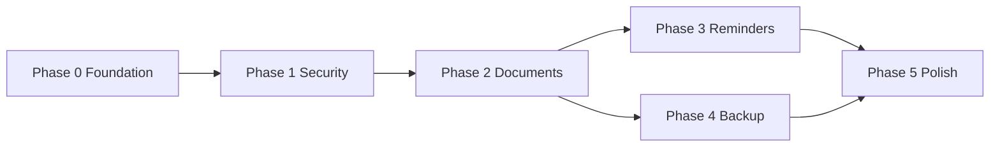

# DocuFind — Implementation Plan

Phased delivery for a local-only secure document vault.

## Current feature matrix - 2026-07-01

| Area | Status | Notes |
|------|--------|-------|
| Vault unlock | Stable build | PIN/biometric unlock routes to Vault content without direct screen casts. |
| Vault opening animation | Done | 2.3 second non-blocking shield/document animation after unlock. |
| Module categories | Stabilized | Documents, ID Cards, Cards, Medical, Prescriptions, Vaccination, Education, Insurance, Vehicle, Warranty use loading/error/empty/content states. |
| Family / Pets / Emergency | Existing flows | Dedicated list/detail screens remain routed from category tiles. |
| Record detail | Stabilized | Loading/not-found states retained; edit/delete/share/download failures surface as user errors. |
| File share/download | Stabilized | File decrypt/export exceptions are caught and shown instead of crashing the screen. |
| Build gate | Pass | `./gradlew.bat assembleDebug` passed on 2026-07-01. |

---

## Phase 0 — Foundation ✅ (Current)

**Goal:** Runnable app shell, architecture, docs, build green.

| Task | Status |
|------|--------|
| Gradle project (Kotlin, Compose, Hilt, Room, KSP) | Done |
| Material 3 theme (DocuFind colors) | Done |
| Hilt DI modules | Done |
| Room v1 schema (documents, reminders) | Done |
| DataStore preferences | Done |
| Keystore manager stub | Done |
| Root navigation (splash → onboarding → PIN → biometric → main) | Done |
| Bottom nav: Home, Vault, Reminders, Settings | Done |
| Placeholder UI per design reference | Done |
| Architecture & product documentation | Done |
| Gradle assembleDebug | Done |

**Exit criteria:** App launches without crash; docs complete; no feature APK/AAB release.

---

## Phase 1 — Security Core

| Task | Priority |
|------|----------|
| PIN hashing + secure verification | P0 |
| BiometricPrompt integration | P0 |
| Auto-lock on background / timeout | P0 |
| Vault unlock re-lock flow | P0 |
| Encrypted SharedPreferences or Keystore-wrapped PIN secret | P0 |

**Exit criteria:** User cannot access Home document lists without unlock if vault locked policy applies.

---

## Phase 2 — Document Management

| Task | Priority |
|------|----------|
| Import from gallery / file picker | P0 |
| Camera capture | P1 |
| Encrypted file storage pipeline | P0 |
| Document list per category | P0 |
| Document detail + viewer (PDF/image) | P0 |
| Search across titles/metadata | P1 |
| Filter chips (PDF, Images, Others) | P1 |
| FAB add document | P0 |

**Exit criteria:** User can add, view, and delete a PDF locally.

---

## Phase 3 — Reminders

| Task | Priority |
|------|----------|
| CRUD reminders in Room | P0 |
| Filter chips wired to DAO | P0 |
| Local notifications (AlarmManager/WorkManager) | P1 |
| Link reminder to document/category | P2 |

---

## Phase 4 — Backup & Settings

| Task | Priority |
|------|----------|
| Encrypted local backup export | P1 |
| Restore from backup file | P1 |
| Storage usage screen | P1 |
| Security settings (change PIN, biometrics toggle) | P0 |
| Help & About content | P2 |
| Family / emergency contacts (local records) | P3 |

---

## Phase 5 — Polish & Hardening

| Task | Priority |
|------|----------|
| Room migrations (remove destructive) | P0 |
| UI polish vs mockup pixel pass | P1 |
| Accessibility audit | P1 |
| Instrumentation tests (navigation, DB) | P1 |
| ProGuard/R8 rules for release | P2 |
| App icon & splash final assets | P2 |

---

## Dependency Order

---

## Technical Debt (Known)

- PIN not yet cryptographically stored — flag only
- `fallbackToDestructiveMigration()` — dev only
- Reminders screen uses placeholder data
- Category navigation is no-op
- Document file encryption not implemented

---

## Build & Release Policy

- CI: `./gradlew assembleDebug` on every PR (future)
- No APK/AAB artifacts until Phase 5 sign-off
- Versioning: `versionName` semver in `app/build.gradle.kts`

---

## Team Conventions

- Package by feature under `ui/screens/{feature}/`
- ViewModels suffixed with `ViewModel`
- Repository interfaces in `domain`, impls in `data`
- New screens: add route to `DocuFindRoutes` + NavHost
- Document schema changes: bump Room version + migration + update `DOCUFIND_DATABASE_SCHEMA.md`
