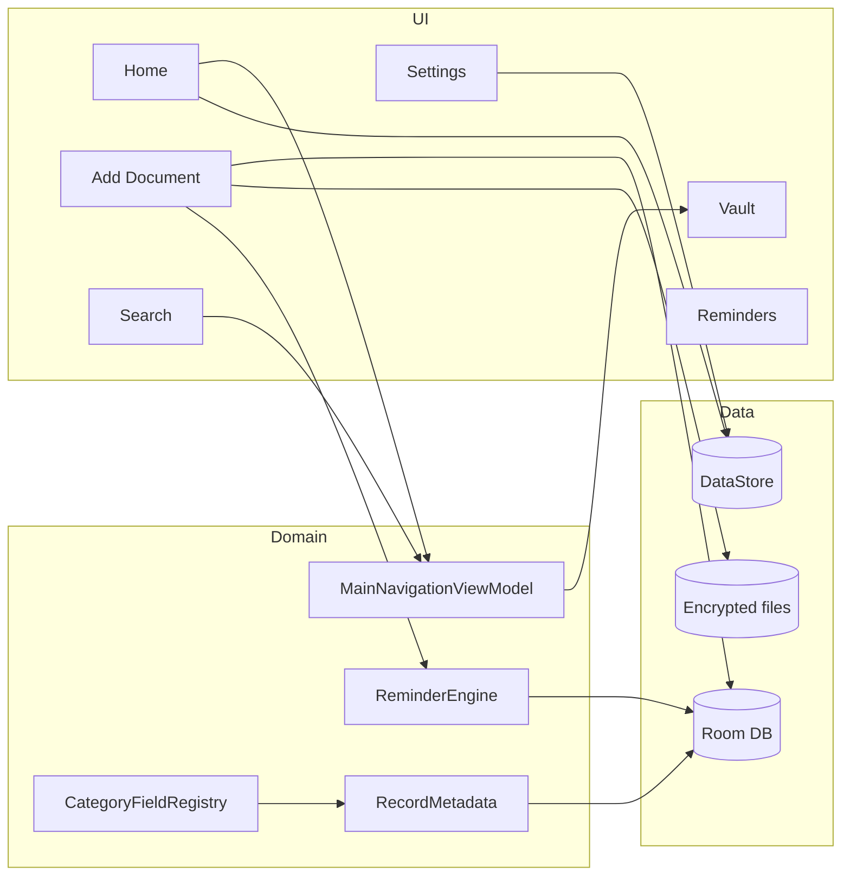

# DocuFind — Integration Integrity

Maps app modules/integrations to the tests that protect them. Use this when assessing blast radius of a change.

---

## Module interaction map

---

## Integrations and protecting tests

| Integration | How it works | Protecting tests |
|-------------|--------------|------------------|
| **Reminder ↔ document expiry** | `ReminderEngine.syncVaultRecordExpiry()` creates 5 offset reminders per `sourceKey` prefix | `ReminderEngineTest`, `ReminderScheduleDefaultsTest`, `ReminderTriggerCalculatorTest` |
| **Reminder actioned ↔ notifications** | `completeReminderEvent()` completes whole linked group + cancels alarms | `ReminderEngineTest`, `ReminderDaoTest` |
| **Vault ↔ recent items** | `MainNavigationViewModel.openRecord()` gates on PIN + session | `MainNavigationViewModelVaultGateTest` |
| **Vault ↔ search** | `openSearch()` requires unlock or PIN setup | `MainNavigationViewModelVaultGateTest` |
| **Profile ↔ home greeting** | `HomeViewModel` reads `PreferencesRepository.userName` | Manual + future `HomeViewModelTest` |
| **Tagline ↔ home** | `HomeTaglines.pickRandom()` on resume | `HomeTaglinesTest` |
| **Category ↔ form fields** | `CategoryFieldRegistry.fieldsFor()` drives `CategoryFieldsForm` | `CategoryFieldRegistryTest` |
| **Category ↔ sensitive tags** | `RecordMetadata.buildMetadataTags()` encrypts SENSITIVE/PASSWORD | `RecordMetadataTest` |
| **Document ↔ multiple files** | `vault_files` FK to `vault_records` | `VaultRecordDaoTest` |
| **Notification ↔ reminder** | `ReminderAlarmScheduler` + `ReminderNotificationHelper` | `ReminderEngineTest` (schedule/cancel); instrumented TBD |
| **Settings ↔ security** | Security screen → PIN/biometric/auto-lock DataStore | UI instrumented TBD |
| **Settings ↔ storage** | Storage summary from DAO file counts | DAO tests + manual |
| **Settings ↔ support** | Help email intent + diagnostics | Manual + manifest queries lint |
| **Backup ↔ database** | Export/import encrypted archive | `BackupEncryptionTest`; restore integration TBD |
| **Search ↔ index** | `SearchRepositoryImpl` → `SearchIndexDao` | `SearchRepositoryImplTest` |
| **Migration ↔ existing users** | Explicit migrations v1→9, pre-migration backup | `DocuFindMigrationTest`, `DocuFindMigrationInstrumentedTest` |
| **Onboarding ↔ navigation** | Splash → onboarding → profile → main | Instrumented navigation TBD |
| **Screenshot ↔ sensitive screens** | `ForceSecureScreenEffect` / `ScreenshotProtection` | Manual; instrumented FLAG_SECURE TBD |

---

## Linkage details

### Reminder-to-document

- Source keys: `record:{id}:expiry:{15|7|3|1|0}`
- Disabling expiry or toggling reminder off → `disableBySourceKeyPrefix`
- Document date change → `syncOffsetSchedule` upserts expected keys, disables stale

### Vault-to-recent-item

- Recent item click → `openRecord(recordId)`
- If locked: `UnlockPromptState.visible = true`, navigation deferred until `onUnlockSuccess`

### Profile-to-home

- `profileCompleted` + `userName` in DataStore
- Home shows `Welcome, {Name}` — not in Room (safe across DB migrations)

### Category-to-form-field

- Add flow uses `CategoryFieldRegistry` for issue/expiry visibility and field list
- Sensitive values never stored plaintext in tags

### Document-to-file

- One `vault_records` row, many `vault_files` rows (CASCADE delete)
- File bytes on disk encrypted separately (SQLCipher DB + AES-GCM files)

### Notification-to-reminder

- Active reminders with future `triggerAt` scheduled on app start (`rescheduleAllActive`)
- Permission tracked by `NotificationPermissionTracker`

### Backup/restore-to-database

- Backup encrypts DB export + file manifest
- Restore replaces local data — merge not supported (documented limitation)

---

## When to add integration tests

Add an **androidTest/integration** test when:

- Two or more modules are wired together (e.g. save document → reminder rows appear)
- A bug was missed by unit tests alone
- Navigation + ViewModel + repository interact

Prefer **unit tests with mocks** when a single class owns the logic.

---

## Related docs

- [DOCUFIND_TESTING_STRATEGY.md](./DOCUFIND_TESTING_STRATEGY.md)
- [DOCUFIND_TEST_COVERAGE_REPORT.md](./DOCUFIND_TEST_COVERAGE_REPORT.md)
- [DOCUFIND_ARCHITECTURE.md](./DOCUFIND_ARCHITECTURE.md)
