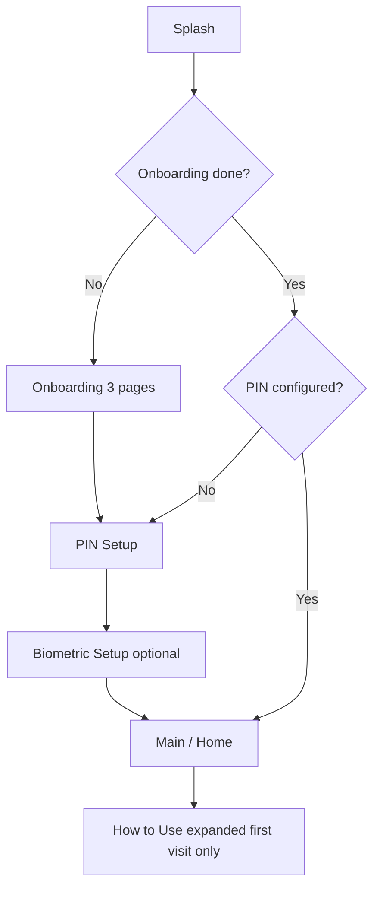

# DocuFind — Onboarding & First-Time Education

**Phase 1 status:** Complete

## Overview

DocuFind guides new users through a **splash → onboarding → security setup → home education** flow. All state is stored locally in DataStore; no network calls.

## User Flow

## Splash Screen

| Element | Content |
|---------|---------|
| Logo | Folder + lock + search magnifier (brand mark) |
| App name | DocuFind |
| Tagline | Find it. Lock it. Trust it. |
| Privacy message | 100% Private. Your data stays on your device. |
| Duration | ~1.2s before routing |

**Routing logic** (`SplashViewModel`):

- Onboarding not completed → `ONBOARDING`
- PIN not configured → `PIN_SETUP`
- Otherwise → `MAIN`

## Onboarding (3 Pages)

Horizontal pager with dot indicators, Skip (top-right), Next / Get Started CTA.

| # | Title | Subtitle |
|---|-------|----------|
| 1 | Welcome to DocuFind | Your personal document vault. Secure, private and easy to use. |
| 2 | Organize life's important records | Store documents, ID cards, medical records, insurance, vehicle papers, pet records and more. |
| 3 | Find fast. Stay reminded. | Search records quickly and get reminders before expiry, renewal, vaccination or medicine dates. |

**On completion (or Skip):**

1. `onboarding_completed = true` in DataStore
2. Navigate to **PIN Setup** (security setup — not skipped)

## Security Setup (Post-Onboarding)

Not part of onboarding copy but required before main app:

1. **PIN Setup** — 6-digit PIN with confirmation
2. **Biometric Setup** — optional Enable / Skip

When security setup finishes (`finishSecuritySetup`):

- `how_to_use_auto_expand_pending = true` — triggers first-time Home education

## How to Use DocuFind (First-Time Education)

Collapsible card on **Home** with six steps displayed as a **2×3 tile grid** (matching design reference):

| Step | Title | Description |
|------|-------|-------------|
| Add | Add | Add documents using scan, gallery or files. |
| Organize | Organize | Choose category, add tags & notes. |
| Secure | Secure | Stored in encrypted vault on your device. (teal accent) |
| Find | Find | Search instantly anytime. |
| Access | Access | View, share or export securely. |
| Remind | Remind | Set reminders for important activities. |

### Expand / Collapse Behavior

| Scenario | Behavior |
|----------|----------|
| First Home visit after setup | Section **expanded** automatically |
| Same session | User can collapse/expand via header toggle |
| Next app launch | Section **collapsed** (auto-expand flag consumed) |
| Settings → How to Use DocuFind | Sets expand request, navigates to Home, section **expanded** |
| Home header toggle | Manual expand/collapse anytime |

### DataStore Keys

| Key | Type | Purpose |
|-----|------|---------|
| `how_to_use_auto_expand_pending` | Boolean | One-shot: expand on first Home after setup |
| `how_to_use_expand_requested` | Boolean | One-shot: expand when opened from Settings |

Both flags are **consumed** (set to `false`) when Home applies them.

## Re-Onboarding

There is no in-app "reset onboarding" in Phase 1. Clearing app data resets all preferences and replays the full flow.

## Implementation Files

| Area | Files |
|------|-------|
| Splash | `ui/screens/splash/SplashScreen.kt`, `SplashViewModel.kt` |
| Onboarding | `ui/screens/onboarding/OnboardingScreen.kt`, `OnboardingViewModel.kt` |
| Security | `ui/screens/setup/PinSetupScreen.kt`, `BiometricSetupScreen.kt`, `SetupViewModel.kt` |
| Education | `ui/components/HowToUseSection.kt`, `ui/screens/home/HomeViewModel.kt` |
| Settings entry | `ui/screens/settings/SettingsScreen.kt`, `SettingsViewModel.kt` |
| Preferences | `data/local/datastore/PreferencesDataStore.kt` |

## Future Enhancements

- Replay onboarding from Settings → Help
- Animated onboarding illustrations per design mockup
- Tooltip coach marks on first category tap
- Localized strings for all markets
