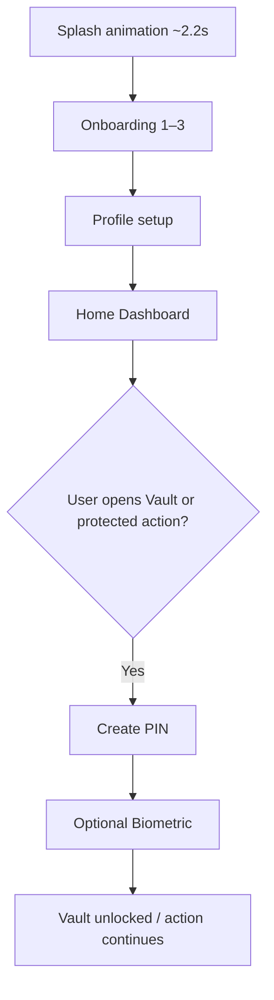
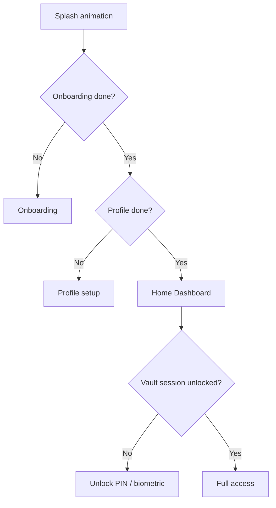

# DocuFind — User Flow

Aligned with the approved brand reference and deferred security model.

## First launch

- **Skip Tour** → profile setup (onboarding marked complete).
- **Get Started** (page 3) → profile setup.
- **Profile:** Name required; mobile/email optional; stored locally only.
- **PIN / biometric** never at splash or onboarding — only Vault, recent items, search, or secure save.

## Returning user

## Home personalization

- Greeting: **Welcome, {Name}** (from local profile).
- Rotating tagline below greeting; first letter uses random accent from palette (once per Home open).

## Main app navigation

| Bottom tab | Behavior |
|------------|----------|
| Home | Welcome, tagline, search, quick access, recent items |
| Vault | No PIN → setup; locked → Unlock; unlocked → browse/search |
| Add | Add document; PIN setup if saving without PIN |
| Reminders | Reminder lists |
| Settings | Security, backup, support |

## Secure content

- Vault session locks when app is backgrounded.
- Idle auto-lock via `ScreenTimeoutManager`.
- Protected actions prompt **Unlock** overlay when locked.
- Portrait lock on `MainActivity` (no auto-rotate).

See also: [DOCUFIND_BRAND_GUIDELINES.md](./DOCUFIND_BRAND_GUIDELINES.md), [DOCUFIND_ONBOARDING.md](./DOCUFIND_ONBOARDING.md)
